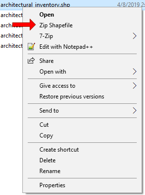

SHP2ZIP Win
--------------
This utility adds a context menu item for '.shp' files in Windows Explorer that uses [7-zip](https://www.7-zip.org/) to zip the '.shp' along with all the associated files (such as dbf, shx, dbf, ...).

## Installation
First, make sure you have installed [7-zip](https://www.7-zip.org/).

Then [download the release]() and run `install.bat` by double clicking it. A reboot may be necessary for the option to become available when you right-click '.shp' files.

## Removal
Just run `uninstall.bat` at any time to remove the option from your right click menu.

## License
This software is MIT licensed.

## Attribution
Thanks to ORelio's FileActionsManager and 7-Zip for making this project possible!
